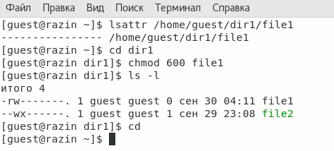
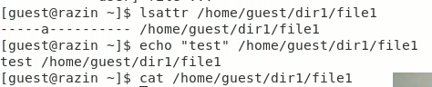
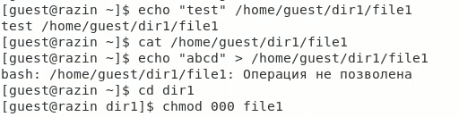
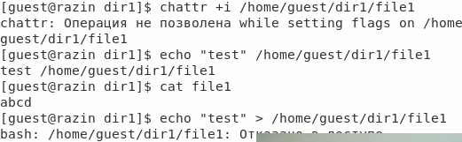

---
# Front matter
title: "Отчёт по лабораторной работе №4"
subtitle: "Дискреционное разграничение прав в Linux. Расширенные атрибуты"
author: "Разин Никита Андреевич, НБИбд-402-18"

# Generic otions
lang: ru-RU
toc-title: "Содержание"

# Bibliography
bibliography: bib/cite.bib
csl: pandoc/csl/gost-r-7-0-5-2008-numeric.csl

# Pdf output format
toc: true # Table of contents
toc_depth: 2
lof: true # List of figures
lot: true # List of tables
fontsize: 12pt
linestretch: 1.5
papersize: a4
documentclass: scrreprt
## I18n
polyglossia-lang:
  name: russian
  options:
	- spelling=modern
	- babelshorthands=true
polyglossia-otherlangs:
  name: english
### Fonts
mainfont: PT Serif
romanfont: PT Serif
sansfont: PT Sans
monofont: PT Mono
mainfontoptions: Ligatures=TeX
romanfontoptions: Ligatures=TeX
sansfontoptions: Ligatures=TeX,Scale=MatchLowercase
monofontoptions: Scale=MatchLowercase,Scale=0.9
## Biblatex
biblatex: true
biblio-style: "gost-numeric"
biblatexoptions:
  - parentracker=true
  - backend=biber
  - hyperref=auto
  - language=auto
  - autolang=other*
  - citestyle=gost-numeric
## Misc options
indent: true
header-includes:
  - \linepenalty=10 # the penalty added to the badness of each line within a paragraph (no associated penalty node) Increasing the value makes tex try to have fewer lines in the paragraph.
  - \interlinepenalty=0 # value of the penalty (node) added after each line of a paragraph.
  - \hyphenpenalty=50 # the penalty for line breaking at an automatically inserted hyphen
  - \exhyphenpenalty=50 # the penalty for line breaking at an explicit hyphen
  - \binoppenalty=700 # the penalty for breaking a line at a binary operator
  - \relpenalty=500 # the penalty for breaking a line at a relation
  - \clubpenalty=150 # extra penalty for breaking after first line of a paragraph
  - \widowpenalty=150 # extra penalty for breaking before last line of a paragraph
  - \displaywidowpenalty=50 # extra penalty for breaking before last line before a display math
  - \brokenpenalty=100 # extra penalty for page breaking after a hyphenated line
  - \predisplaypenalty=10000 # penalty for breaking before a display
  - \postdisplaypenalty=0 # penalty for breaking after a display
  - \floatingpenalty = 20000 # penalty for splitting an insertion (can only be split footnote in standard LaTeX)
  - \raggedbottom # or \flushbottom
  - \usepackage{float} # keep figures where there are in the text
  - \floatplacement{figure}{H} # keep figures where there are in the text
---

# Цель работы

Получение практических навыков работы в консоли с расширенными атрибутами файлов.

# Задание

Получить практические навыки работы в консоли с расширенными атрибутами файлов.

# Теоретическое введение

В UNIX-системах, кроме стандартных прав доступа, существуют также дополнительные или специальные атрибуты файлов, которые поддерживает файловая система. С помощью утилиты chattr можно управлять атрибутами

Установить атрибут i на файл

chattr +i file.txt

Посмотреть текущие атрибуты можно командой lsattr

lsattr file.txt 

----i---------- file.txt

Перечень атрибутов:

A - (no atime updates) не изменять время последнего обращения, что может благоприятно повлиять на производительность файловой системы, если обращение происходит очень часто;
a - (append only) в файл можно только дописывать, но нельзя удалять/переименовывать (удобно для логов). Если установлено на каталог, то находящиеся там файлы удалять нельзя, но можно создавать новые и модифицировать существующие;
i - (immutable) пожалуй самый используемый и полезный бит, который запрещает любые изменения файла (нельзя удалять, переименовывать и модифицировать файл). Для директории данный флаг позволяет модифицировать в ней файлы, но нельзя удалять или создавать новые;
I - показывает, что каталог был проиндексирован при использовании htree. Нельзя установить/снять с помощью chattr, можно лишь посмотреть командой lsattr.

И многие другие атрибуты...
[[1]](https://wiki.enchtex.info/doc/linux_file_attributes)

# Выполнение лабораторной работы

1. От имени пользователя guest определил расширенные атрибуты файла
/home/guest/dir1/file1 командой

lsattr /home/guest/dir1/file1
 ([рис. 1](image/1.png))

{ #fig:001 width=70% }

2. Попробовал установить на файл /home/guest/dir1/file1 расширенный атрибут a от имени пользователя guest, а после с пользователя root:

chattr +a /home/guest/dir1/file1
([рис. 2](image/2.png)).

3. Выполнил дозапись в файл file1 слова «test» командой:

echo "test" /home/guest/dir1/file1

После этого выполнил чтение файла file1 командой
cat /home/guest/dir1/file1

Убедился, что слово test было успешно записано в file1.
([рис. 3](image/3.png))

{ #fig:004 width=70% }

4. Попробовал удалить файл file1 либо стереть имеющуюся в нём информацию командой:

echo "abcd" > /home/guest/dirl/file1

Попробовал с помощью команды 

chmod 000 file1

установить на файл file1 права, например, запрещающие чтение и запись для владельца файла.
([рис. 4](image/4.png))
{ #fig:005 width=70% }

5. Далее я повторял свои прошлые действия по шагам, заменив атрибут «a» атрибутом «i».
{ #fig:006 width=70% }

# Выводы

В результате выполнения работы я повысил свои навыки использования интерфейса командой строки (CLI), познакомился на примерах с тем, как используются основные и расширенные 
атрибуты при разграничении доступа. Также я имел возможность связать теорию дискреционного разделения доступа с её реализацией на практике в ОС Linux. 
Я приобрел практические навыки работы в консоли с расширенными атрибутами файлов «а» и «i».

# Список литературы{.unnumbered}

1. [Дополнительные атрибуты файлов](https://wiki.enchtex.info/doc/linux_file_attributes)